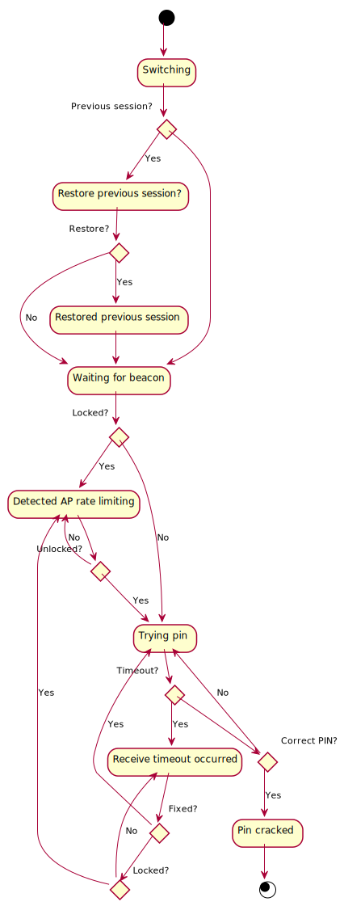

# Internals

This documents bits and pieces of how Cycle works internally, and the logic/reasoning behind the code.

## Reading from Reaver

I thought that parsing text from all tools was equally easy. I was wrong. One has to take into account all sorts of small details, which have a combinatory effect and get complicated very quickly.

One such detail is how Reaver outputs text on the command line. I may have done this the long way around, but Cycle interprets Reaver output by creating its own [state machine](https://en.wikipedia.org/wiki/Finite-state_machine) of sorts. It needs to understand (a subset of) the possible output that Reaver may print at any time, and then scan lines to match that output.

It does so by using [pexpect](https://pexpect.readthedocs.io/en/stable/) (while it uses `Popen` from [subprocess](https://docs.python.org/3/library/subprocess.html) for managing other processes such as `mdk4`) to ease issues concerning sending input to interactive confirmation prompts to `reaver`, and for convenience functions for `expect`ing output.

### The State Machine

To ease my (and others') understanding of Reaver's output and how Cycle is intended to function (since I'm yet to implement functionality following this diagram), I used [PlantUML](https://plantuml.com) to create the diagram below showing the output that Reaver will print given in scenarios that Cycle is concerned about. Reaver may well print far more than this, but this should establish a reasonable baseline.

### Terminating Reaver

Prior to recently, all processes that are spawned by Cycle are `kill`ed when Cycle is done with them. An example of this is when a network is being DDoSed, and becomes unlocked. The DDoS processes (`mdk4`) are sent `kill()` because we don't care much about asking them nicely and waiting for them to `terminate`. 

One mistake I made was asking Reaver to do the same. The problem with this is that Reaver saves state containing the PINs that it has tried against WPS networks. If Reaver is `kill`ed, it doesn't save that state. What I found then, is that:
 
- Cycle would fire up
- Successfully run one PIN attack round
- Get locked out
- `kill` Reaver to start `mdk4` attacks
- This didn't give Reaver a chance to save, so when the network came back up, it would attack using the **same** PIN.
- Rinse and repeat

Instead, `pexpect` has a lovely function called `send_control`, which allows sending <kbd>Ctrl</kbd> + <kbd>C</kbd> that allows Reaver to save those valuable PINs. On reflection, I may have been able to use `terminate` to achieve the same goal, but I know from experience that <kbd>Ctrl</kbd> + <kbd>C</kbd> works as expected, so it was better to stick with what I knew.